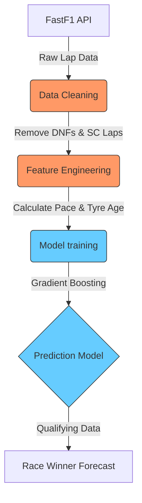
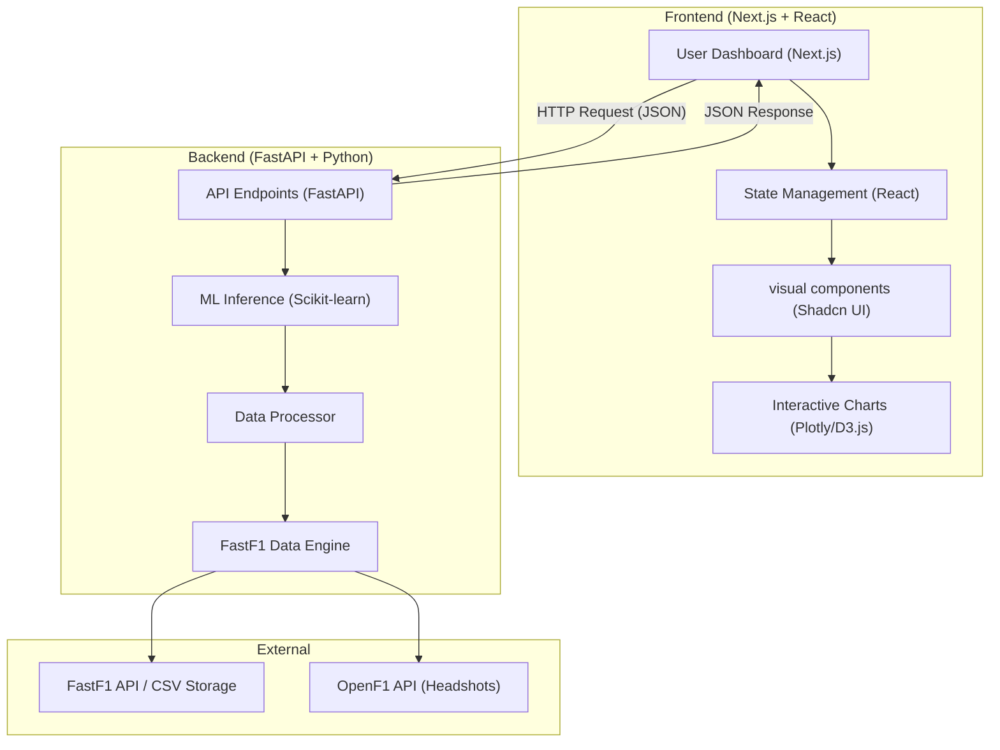

# 🧠 Project Learnings & Theoretical Concepts

This document serves as a living cheat sheet for the theoretical aspects, logic, and Machine Learning (ML) pipelines used in the F1 Race Winner Prediction project. It will be updated continuously as new concepts are introduced.

---

## 🏗️ 1. Machine Learning Pipelines
**Definition:** 
An ML pipeline is a sequence of automated steps used to extract, process, train, and deploy machine learning models. It ensures that the raw data (like F1 lap times and telemetry) is consistently transformed before being passed to an algorithm.

### 📊 F1 Prediction Pipeline Architecture


---

## 🌲 2. RandomForestRegressor
**Definition:**
A `RandomForestRegressor` is an ensemble learning method. It operates by constructing a multitude ("forest") of decision trees during training and outputs the average prediction of the individual trees.

**Theory:**
Instead of relying on one single complex decision tree (which might memorize the training data and fail on new data—a concept called *overfitting*), a Random Forest builds many smaller, randomized trees. By averaging their results, it becomes highly robust and accurate.

**Code Snippet:**
```python
from sklearn.ensemble import RandomForestRegressor

# Initialize the model with 100 decision trees
rf_model = RandomForestRegressor(n_estimators=100, random_state=42)

# Train the model mapping features (X) like Grid Position to Target (y) like Finish Position
rf_model.fit(X_train, y_train)

# Predict 
predictions = rf_model.predict(X_test)
```

---

## 🚀 3. GradientBoostingRegressor
**Definition:**
Gradient Boosting is another ensemble technique, but instead of building trees independently like a Random Forest, it builds trees sequentially. Each new tree attempts to correct the errors (the *residuals*) made by the previous trees.

**Theory:**
Think of it like playing golf. Your first shot gets you close to the hole. Your second shot corrects the error of your first shot to get closer. The third shot taps it in. `GradientBoostingRegressor` mathematically minimizes the 'loss' (error distance) step-by-step using a method called *Gradient Descent*.

**Code Snippet:**
```python
from sklearn.ensemble import GradientBoostingRegressor

# Initialize the model 
gb_model = GradientBoostingRegressor(n_estimators=100, learning_rate=0.1, max_depth=3)

# Train the model on historical F1 data
gb_model.fit(X_train, y_train)

# Predict future race times
predictions = gb_model.predict(X_test)
```

---

## 🛠️ 4. What is scikit-learn?
**Definition:** 
`scikit-learn` (often imported as `sklearn`) is the most robust and widely used machine learning library for Python. 
**Why we use it:** It provides simple and efficient tools for predictive data analysis, including both of the regressor models mentioned above, as well as utilities for splitting data (`train_test_split`) and evaluating results (`mean_absolute_error`).

---

## 📚 Additional Resources for ML Beginners
- **Scikit-Learn Official Demos:** [scikit-learn.org](https://scikit-learn.org/stable/tutorial/index.html)
- **StatQuest with Josh Starmer (YouTube):** Fantastic, easy-to-understand visual explanations for [Random Forests](https://www.youtube.com/watch?v=J4Wdy0Wc_xQ) and [Gradient Boosting](https://www.youtube.com/watch?v=3CC4N4z3GJc).
- **Kaggle F1 Datasets:** Explore community discussions on predictive models at [kaggle.com](https://www.kaggle.com/).

---

## 🏎️ 5. FastF1 Data Structure
**Concept:**
When we fetch data using `fastf1`, we primarily deal with `Laps` objects, which internally are pandas DataFrames. Each row represents a single lap completed by a driver in a session.

**Key Columns in our 2025 Dataset:**
- `LapTime`: The total time taken to complete the lap (our primary target for regression).
- `LapNumber`: The sequence of the lap in the race.
- `Stint`: The number of the tire set being used (e.g., Stint 1 is the first set of tires).
- `Compound`: The tire type (SOFT, MEDIUM, HARD, INTERMEDIATE, WET).
- `TyreLife`: How many laps the current set of tires has already completed.
- `Driver`: The 3-letter driver code (e.g., VER, HAM, LEC).

**Logic:**
To predict a "Race Winner," we can't just look at one lap. We need to understand **Pace Consistency** and **Degradation**. A driver might have the fastest single lap but lose the race because their tires "drop off" (become significantly slower) faster than others.

---

## 🧹 6. Data Cleaning for F1
**Goal:** 
To predict race-winning pace, we need "clean" data. Raw F1 data is noisy because of factors that don't represent a car's actual speed.

**Factors we filter out:**
- **DNFs (Did Not Finish):** Rows with missing LapTimes.
- **Safety Car (SC/VSC):** Laps where drivers must drive slowly. These skew the model into thinking the car is slow.
- **Pit Stops:** The lap entering and exiting the pits includes slow movement in the pit lane. 
- **Anomalies:** Spins or minor collisions that don't trigger a flag but result in a very slow lap.

**Theoretical Logic:**
By removing this noise, we allow the ML model to focus on the **True Racing Potential** of each car/driver combination.

---

## 📈 7. Feature Engineering for F1
**Definition:**
Feature engineering is the process of using domain knowledge (F1 race rules and physics) to create new variables that help an ML model understand the data better.

**Features we created:**
1. **Rolling Pace:** Instead of one lap, we look at the average of the last 3 laps. This shows if a driver is "in the zone" or struggling with consistency.
2. **Compound Score:** We convert categorical tire names (SOFT, MEDIUM, HARD) into numbers. A 'SOFT' tire is given a higher score because it's mathematically faster but wears out quicker. 
3. **Estimated Fuel Load:** F1 cars start with ~100kg of fuel and get lighter every lap (making them faster). We estimate this by calculating `Total Laps - Current Lap`.
4. **Normalized Lap Time:** Since a 1:10.000 in Monaco is different from a 1:20.000 in Silverstone, we divide each lap by the race's median time. This allows our Gradient Booster to learn "relative pace" across all 24 tracks.

---

## ✂️ 8. Train/Test Split
**Definition:**
To know if our F1 predictor is actually good, we can't test it on the same data it learned from. That would be like giving a student the exact same questions from the textbook during the final exam—they might just memorize the answers.

**Logic:**
- **Training Set (80%):** The "Textbook." The model uses this to find patterns between `TyreAge`, `FuelLoad`, and `LapTime`.
- **Testing Set (20%):** The "Final Exam." We hide this data from the model. After training, we ask the model to predict the lap times for these rows. If the predictions are close to the actual times, we have a reliable model!

---

## 📉 9. Model Evaluation (MAE & R²)
**Definitions:**
- **MAE (Mean Absolute Error):** This is the average of the absolute differences between predictions and actual values. In our F1 project, an MAE of 0.005 on NormalizedLapTime means the model is, on average, just a few milliseconds off the actual relative pace!
- **R² Score:** A measure of how well the features (X) explain the variance in the target (y). 1.0 is perfect; 0.0 means the model is no better than guessing the average.
- **Feature Importance:** This tells us which input factor (like `RollingPace` vs `TyreLife`) had the biggest impact on the decision-making process of the trees.

---

## 🔮 10. Inference & Real-Time Prediction
**Definition:**
Inference is the stage where we use the *trained* model to predict outcomes on *new* data.

**How we predict 2026 winners:**
1. **Fetch Live Qualifying Data:** We take the fastest qualifying lap for each driver.
2. **Apply Features:** We assume the driver will start with a full fuel load (`EstFuelLoad`) and fresh tires (`TyreLife = 1`).
3. **Predict Pace:** The model looks at the driver's qualifying performance (`RollingPace`) and adjusts it based on the weight of the car and the tire compound they plan to start with.
4. **Ranking:** The driver with the lowest predicted "Race Pace Score" is our forecast winner. 

---

## 🎨 11. GUI & Data Visualization (Streamlit & Plotly)
**Definition:**
A Graphical User Interface (GUI) allows non-technical users to interact with our ML model without needing to look at Python code. 

**Tools Used:**
- **Streamlit:** A framework that turns Python scripts into interactive web apps. It manages the 'State' of the app (e.g., which driver the user selected).
- **Plotly:** A library for creating interactive, web-based charts. Unlike static images, Plotly allow users to zoom in on corners or hover over specific lap distances to see telemetry values.

**Visualizing Telemetry:**
By overlaying two speed traces on the same X-axis (Distance), we can see exactly where one driver is braking earlier or accelerating harder. This "Feature Visualization" helps validate why the ML model might predict one driver to be faster than another.

---

## 🛠️ 12. Professional Full Stack Architecture (Next.js + FastAPI)
**Overview:**
For a "Full Phase" production application, we move away from Streamlit and split the app into two distinct parts: a **Frontend (UI)** and a **Backend (API)**.

### Architecture Diagram:


### Key Differences:
1.  **JSON API**: The backend only sends *data* (JSON), not visual blocks. This makes the app much faster because the browser only updates the specific numbers or charts that changed.
2.  **Concurrency**: FastAPI can handle hundreds of users simultaneously, whereas Streamlit scripts run sequentially per user.
3.  **Advanced UI**: With Next.js, you have total control over every pixel, allowing for "Flicker-free" transitions and smooth animations between race views.

---

## ☁️ 13. Scalability & Free Tier Deployment Strategy
**Definition:**
Achieving production-level stability and high-performance scalability without incurring hosting costs. We've evolved beyond local python processes to a distributed cloud architecture.

### Recommended Technology Stack:
1. **Frontend (Vercel)**: Next.js edge-network caching ensures the site loads instantly. Vercel's hobby tier provides massive free bandwidth for static & dynamic rendering.
2. **Backend (Render/Railway)**: FastAPI handles high-concurrency requests easily utilizing ASGI (Uvicorn). Render/Railway offer generous free tiers for spinning up Dockerized microservices.
3. **Database (Supabase)**: Moving from local `.csv` files to a managed PostgreSQL database. Supabase offers a robust free tier (500MB DB) with instant CRUD APIs to store massive telemetry logs efficiently.
4. **Data Visualization (Recharts / ECharts)**: F1 telemetry generates thousands of graph points per lap. We use hardware-accelerated libraries in React to ensure smooth zooming and panning over speed telemetry without dropping browser frames.

---
*The F1 2026 Professional Roadmap is now fully scalable!* 🏁🚀
